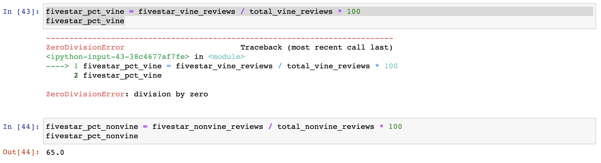

# Amazon_Vine_Analysis
Big data project for Data Analysis &amp; Visualization Program at University of Texas

## Overview

The purpose of this analysis was to determine whether participating in the Vine program, where sellers pay extra fees in exchange for reviews from Vine customers (who receive discounted goods), results in a greater proportion of five-star reviews for the seller. This required us to utilize Amazon Web Services in conjunction with PostgreSQL to work with the large quantities of data from the reviews website.

## Results

First we created an Amazon Web Services PostgreSQL database instance, which we named "amazonvineanalysis". We connected our pgAdmin to the AWS server and created empty tables to hold our data. We used PySpark to pull data from Amazon's s3 catalog of reviews and built four dataframes - one each for customers, products, reviews, and Vine data. Finally, we wrote the dataframes to the tables we had created in our AWS database.

Unfortunately, I encountered a problem when writing the dataframes to my database. I received an error that there was no database with the name "amazonvineanalysis". 

 

I tried to troubleshoot the problem but was never able to get anything written to AWS. Every time I selected the tables in pgAdmin they came back empty. In order to complete the exercise I created a local .csv file with the small amount of data I was able to copy from my Colab notebook. 

I wrote a Python script using Pandas to analyze the data and find the proportions of Vine reviews, primarily with the `loc` function.

### Total Reviews
- Vine Reviews: 0
- Non-Vine Reviews: 20

 

### Total Five-Star Reviews
- Five-Star Vine Reviews: 0
- Five-Star Non-Vine Reviews: 13

 

### Percentage Five-Star Reviews
- Percentage of Vine Reviews that were Five-Star: None (No-vine reviews in data set)
- Percentage of Non-Vine Reviews that were Five-Star: 65.0%

 

## Summary

This dataset does not show any positivity bias toward five-star reviews from Vine customers. If anything, it shows a negative bias since all the five-star reviews came from non-Vine customers. Of course, the small size of data I was forced to use makes this analysis unreliable because the sample size is too small to judge, but if this pattern bears out across the whole of the data, then it would not be in a seller's best interest to participate in the Vine program.

An additional analysis that could be done on the data would be to examine the average star-rating given from each review. It could be that, while Vine customers are not giving out five-star reviews, neither are they giving out one-star reviews. If this were the case, it is possible that the average star-rating of a Vine customer is actually higher than that of a non-Vine customer. If this were the case, then the Vine program, overall, would make a positive impact to the seller's star-rating.

